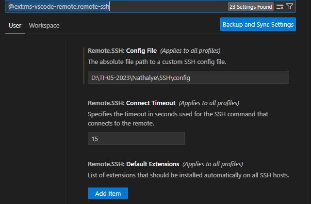

# Preparação de Ambiente
### Vamos preparar o ambiente para desnvolvimento de aplicações
 
#### Neste ambiente iremos instalar e configurar os seguintes recursos:
 - Marquina Virtual(Virtualbox)
 -Distribuição Linux (Ubuntu serve)
 Nasm
 - Compilador da limguagem C
 - configurar o ip e a porta de comunicação entre a máquina real e a virtual
 - Configurar o acesso via SSH entre o VScode e o ServidorLinux
 -Instalar as extensões: Material Icon, Nasm, SSH e Linguagem C/C++


### Máquina Virtual (Virtualbox)


Máquina Virtual é uma ferramenta que permite a criação de novos "computadores" e a Instalação de sistemas operacinais, para estudos ou trabalho.

Para o nosso estudo iremos usar o Virtualbox, da Oracle.
Para instalar, basta fazer download no link a seguir:
<a href="https://www.virtualbox.org/wiki/Downloads" target= "_blank">Virtualbox</a>

##### Criando a maquina Virtual para o nosso estudo

- Configuração:
  > - Nome da Máquina: Servidor
  > - Memória 4GB: (4096)
  > - Processador: (2)
  > - Disco: 100GB
  > - IP e Porta do Host: 127.0.0.1 e 22
  > - IP e Porta do Convidado: 10.0.2.15 e 22


  - Tela Inicial de configuração

  

  
  
  - Tela Inicial de configuração do Hardware

  


  - Tela Inicial de configuração do Disco

  

  
  - Tela Inicial de configuração do Disco

  


  - Tela Inicial de configuração do Disco

  

  
  - Tela Inicial de configuração do Disco

  

  
  #### Distribuição Ubuntu Server
  Para o nosso estudo iremos utilizar uma distribuição Linux para servidores chamada Ubuntu.
  acompanhe o processo de Intalação:

  Link Do Download do Ubuntu:
  <a href=" https://ubuntu.com/download/server"target= "_blank"> Ubuntu Server </a>

   


   - Acompanhe a Instalação

   - Tela de Inicio de instalação

   
   - Tela de Inicio de Idioma

   
   - Tela de Inicio de Teclado

   
   - Tela de tipo de Instalação

   
   - Tela de Configuração de rede

   
   - Tela Configuração do proxy

   
   - Tela pacotes de atualização

   
   - Tela Configuração do disco

   
   
   - Tela Configuração do usuario

   
   - Tela Configuração do SSH 

   
   - Tela do fim da instalação

   
   
   
   #### Atualização do sistema

   Para a correta instalação do Ubuntu que acabamos de instalar, será necessário realizar a atualização so sistema.

   Execute o comando a baixo:

   ```
   sudo apt update -y && sudo apt upgrade -y
   ```

  reínicie o seu servidor  usando o comando abaixo:
  
   ```
   reboot
   ```
   
   #### Instalação do compilador NASM

   O compilador do Nasm é uma ferramento que nos permite programar em Assmbly. Assim é possivel criar programas que manipulam dados que estão nos registradores  do processador.

   para instalar o NASM NO Ubuntu, usamos o comando:

   ```
   sudo apt install nasm -y
   ```


   #### Instalação do compilador de Linguagem C 

   Em Linux, o compilador de linguagem C é o GCC. Ele é uma ferramenta importante para do desenvolvimento de programas em C.

   Para instalar use o Comando:

   ```
   sudo apt install gcc -y
   ```

   #### Conexão Servidor e VSCode via SSH

   Precisamos instalar uma extensão no VSCode para acessar o nosso servidor de forma remota.


Configuração do acesso remoto.




  


